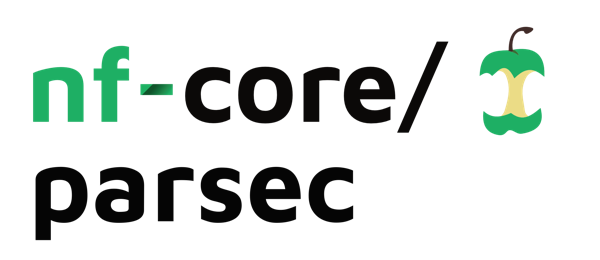

<h1>
  <picture>
    <source media="(prefers-color-scheme: dark)" srcset="docs/images/nf-core-parsec_logo_dark.png">
    
  </picture>
</h1>

[](https://github.com/nf-core/parsec/actions/workflows/ci.yml)
[](https://github.com/nf-core/parsec/actions/workflows/linting.yml)[](https://nf-co.re/parsec/results)[](https://doi.org/10.5281/zenodo.XXXXXXX)
[](https://www.nf-test.com)

[](https://www.nextflow.io/)
[](https://docs.conda.io/en/latest/)
[](https://www.docker.com/)
[](https://sylabs.io/docs/)
[](https://cloud.seqera.io/launch?pipeline=https://github.com/nf-core/parsec)

[](https://nfcore.slack.com/channels/parsec)[](https://twitter.com/nf_core)[](https://mstdn.science/@nf_core)[](https://www.youtube.com/c/nf-core)


## Introduction

**PARSEC** (imPutAtion for spaRSE sequenCing) is a bioinformatics pipeline designed to genotype large populations using low coverage sequencing data.
It relies on `bcftools mpileup` to detect SNP sites and `stitch` to impute genotypes.

**The pipeline is still in early development**


1. Index bams ([`SAMtools`](https://sourceforge.net/projects/samtools/files/samtools/))
2. Prepare fixed size genomic chunks ([`bedtools`](https://github.com/arq5x/bedtools2/))
3. Optionnal : call variants from sparse data
   1. Merge bams on each window ([`SAMtools`](https://sourceforge.net/projects/samtools/files/samtools/))
   2. Call variants for each window ([`bcftools`](http://www.htslib.org/download/))
   3. Concatenate vcf files ([`bcftools`](http://www.htslib.org/download/))
   4. Sort vcf ([`bcftools`](http://www.htslib.org/download/))
   5. Filter variants  ([`bcftools`](http://www.htslib.org/download/))
6. Impute genotypes ([`stitch`](https://github.com/rwdavies/STITCH)
7. Index vcf ([`Tabix`](http://www.htslib.org/doc/tabix.html))
8. Concatenate vcf files  ([`bcftools`](http://www.htslib.org/download/))
9. Sort vcf  ([`bcftools`](http://www.htslib.org/download/))


## Usage

> [!NOTE]
> If you are new to Nextflow and nf-core, please refer to [this page](https://nf-co.re/docs/usage/installation) on how to set-up Nextflow. Make sure to [test your setup](https://nf-co.re/docs/usage/introduction#how-to-run-a-pipeline) with `-profile test` before running the workflow on actual data.


<!-- TODO nf-core: Describe the minimum required steps to execute the pipeline, e.g. how to prepare samplesheets.
     Explain what rows and columns represent. For instance (please edit as appropriate):

Imputation requires a list of variant positions supplied as a vcf (no sample information is needed).
This list can be generated by the pipeline using the calling subworflow or supplied by the user using the `--known_variants` option.

Here is a typical of the pipeline with the avaialble options : 

```bash
nextflow run nf/sparse \
   -profile <docker/singularity/.../institute> \
   --bam "/path/to/data/*.bam" \
   --fasta genome.fa \
	--fai genome.fa.fai \
	--genome_bed genome.bed \
	--genome_sizes genome.sizes.txt  \
	--window_size 1000000 \
	--npop 10 \
	--ngen 100 \
	--buffer_size 100000 \
   --outdir <OUTDIR>
```

> **Warning:**
> Please provide pipeline parameters via the CLI or Nextflow `-params-file` option. Custom config files including those
> provided by the `-c` Nextflow option can be used to provide any configuration _**except for parameters**_;
> see [docs](https://nf-co.re/usage/configuration#custom-configuration-files).

## Credits

PARSEC was originally written in INRAE [GenPhyse](https://genphyse.toulouse.inra.fr/) by Cervin Guyomar.

## Contributions and Support

If you would like to contribute to this pipeline, please see the [contributing guidelines](.github/CONTRIBUTING.md).

## Citations

<!-- TODO nf-core: Add citation for pipeline after first release. Uncomment lines below and update Zenodo doi and badge at the top of this file. -->
<!-- If you use  nf/sparse for your analysis, please cite it using the following doi: [10.5281/zenodo.XXXXXX](https://doi.org/10.5281/zenodo.XXXXXX) -->

<!-- TODO nf-core: Add bibliography of tools and data used in your pipeline -->

An extensive list of references for the tools used by the pipeline can be found in the [`CITATIONS.md`](CITATIONS.md) file.

This pipeline uses code and infrastructure developed and maintained by the [nf-core](https://nf-co.re) community, reused here under the [MIT license](https://github.com/nf-core/tools/blob/master/LICENSE).

> **The nf-core framework for community-curated bioinformatics pipelines.**
>
> Philip Ewels, Alexander Peltzer, Sven Fillinger, Harshil Patel, Johannes Alneberg, Andreas Wilm, Maxime Ulysse Garcia, Paolo Di Tommaso & Sven Nahnsen.
>
> _Nat Biotechnol._ 2020 Feb 13. doi: [10.1038/s41587-020-0439-x](https://dx.doi.org/10.1038/s41587-020-0439-x).
