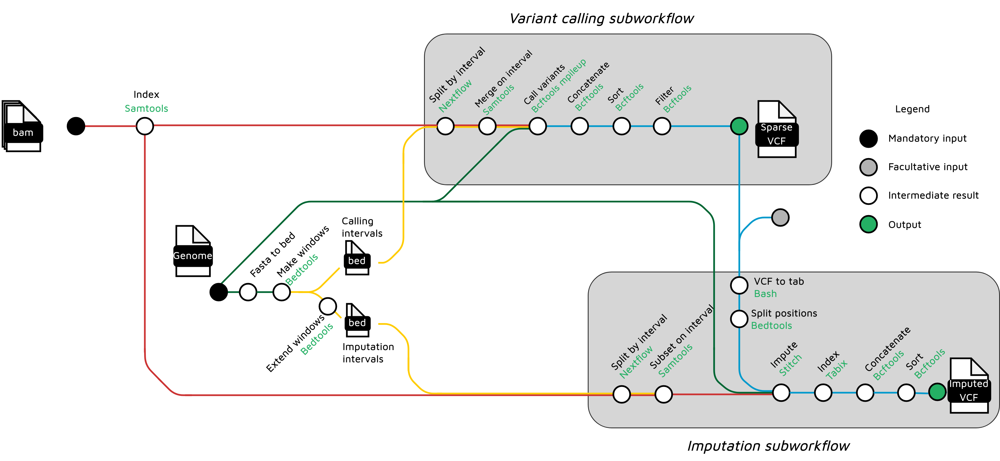

# Introduction

**PARSEC** is a bioinformatics pipeline designed to genotype large populations using low coverage (typically <3X) sequencing data.
Three imputation software are available as of today :
- [`Stitch`](https://github.com/rwdavies/STITCH)
- [`Glimpse1`](https://odelaneau.github.io/GLIMPSE/glimpse1/index.html)
- [`Beagle4`](https://faculty.washington.edu/browning/beagle/b4_0.html)

**The pipeline is still in development, please reach out if you need help for running it or encounter bugs**



1. Index bams ([`SAMtools`](https://sourceforge.net/projects/samtools/files/samtools/))
2. Prepare fixed size genomic chunks ([`bedtools`](https://github.com/arq5x/bedtools2/))
3. Optionnal : call variants from sparse data
   1. Merge bams on each window ([`SAMtools`](https://sourceforge.net/projects/samtools/files/samtools/))
   2. Call variants for each window ([`bcftools`](http://www.htslib.org/download/))
   3. Concatenate vcf files ([`bcftools`](http://www.htslib.org/download/))
   4. Sort vcf ([`bcftools`](http://www.htslib.org/download/))
   5. Filter variants  ([`bcftools`](http://www.htslib.org/download/))
6. Impute genotypes ([`stitch`](https://github.com/rwdavies/STITCH)
7. Index vcf ([`Tabix`](http://www.htslib.org/doc/tabix.html))
8. Concatenate vcf files  ([`bcftools`](http://www.htslib.org/download/))
9. Sort vcf  ([`bcftools`](http://www.htslib.org/download/))


# Usage

## Inputs

### Aligned reads

PARSEC takes `bam` files as input. It is advised to perform duplicated marking and eventually BQSR recalibration on the bam files.
[Sarek](https://nf-co.re/sarek) can be used to automate read alignement (by not specifying any calling tool and eventually adding `--skip_tools baserecalibrator`)

### Reference panel

Depending on the imputation method used, it may be necessary to supply a set of (preferentially phased) known variants (aka reference panel)
- `Glimpse` requires a reference panel supplied with `--ref_panel`
- `Beagle` can take a reference panel supplied with `--ref_panel` as a facultative input
- `Stitch` does not require a reference panel, but requires a set of SNP position, supplied as a vcf file (genotypes are not used). PARSEC can build it automatically using the `calling` subworkflow, but it is advised to validate it before running imputation. A good practice would be to run PARSEC a first time with `--skip_imputation`, hard filter the obtained variants, and run a second PARSEC run with `--sparse_variants` with the output of the first run


| Tool        | VCF Reference panel supplied with `--ref_panel` | VCF of SNPs supplied with `--sparse_variants`                  |
|-------------|-------------------------------------------------|----------------------------------------------------------------|
| **Glimpse** | ✅ Mandatory                                     | ❌ Not applicable                                               |
| **Beagle**  | ⚠️ Facultative                                   | ❌ Not applicable                                               |
| **Stitch**  | ❌ Not applicable                                | ✅ Recommended (hard-filtered output of a PARSEC `calling` run) |

## PARSEC main parameters

default nextflow/nf-core parameters are omitted                                                                                                                                        
                                                                                                                                                                   
Define where the pipeline should find input data and save output data.                                                                                             
                                                                                                                                                                   
| Parameter | Description | Type | Default | Required |                                                                                                            
|-----------|-----------|-----------|-----------|-----------|                                                                                                      
| `bam` | glob for input bams | `string` |  | True |                                                                                                               
| `ref_panel` | Reference  panel VCF | `string` |  |  |                                                                                                            
| `sparse_variants` | VCF of variable positions used in stitch | `string` |  |  |                                                                                  
| `imputation_tool` | Imputation tool (stitch, beagl4 or glimpse) | `string` | stitch | True |                                                                     
| `fasta` | Path to FASTA genome file. <details><summary>Help</summary><small>This parameter is *mandatory* if `--genome` is not specified. If you don't have a BWA
index available this will be generated for you automatically. Combine with `--save_reference` to save BWA index for future runs.</small></details>| `string` |  |                                                                         
| `genome_subset` | bed file specifying a genomic region to analyze | `string` |  |  |                                                                             
| `window_size` | Size of genomic windows used for parrallelization | `integer` | 1000000 |  |                                                                     
| `buffer_size` | Length of overlap between windows. A minimal overlap is required for good imputation | `integer` | 100000 |  |                                   
| `ngen` | Stitch parameter - number of iterations | `integer` | 1000 |  |                                                                                                                                
| `npop` | Stitch parameter - number of haplotypes | `integer` | 10 |  |                                                                                                                                  
| `skip_imputation` | Stop after calling/genotyping | `boolean` |  |  |   *


## Example usage

> **Note**
> If you are new to Nextflow and nf-core, please refer to [this page](https://nf-co.re/docs/usage/installation) on how
> to set-up Nextflow. Make sure to [test your setup](https://nf-co.re/docs/usage/introduction#how-to-run-a-pipeline)
> with `-profile test` before running the workflow on actual data.
> ( not yet available for PARSEC)

### I have a reference panel

```bash
nextflow run cguyomar/PARSEC \
   -profile <docker/singularity/.../institute> \
   --bam "/path/to/data/*.bam" \
   --fasta genome.fa \
   --ref_panel my_panel.vcf.gz \
   --imputation_tool glimpse \ # or beagle4  
   --outdir <OUTDIR>
```

### I don't have a reference panel - Stitch

PARSEC will perform a rough SNP calling on your data (using `bcftools mpileup`) and then used the detected positions for stitch imputation

```bash
nextflow run cguyomar/PARSEC \
   -profile <docker/singularity/.../institute> \
   --bam "/path/to/data/*.bam" \
   --fasta genome.fa \
   --imputation_tool stitch \ # or beagle4  
   --outdir <OUTDIR>
```

A preferred approach is to do perform some user-defined hard filtering on the `mpileup`, first using option `--skip_imputation`, and then filtering the variant calling output (using for instance QUAL, or some external validation set).

An imputation PARSEC run can then be run using the filtered variants as a primer :

```bash
nextflow run cguyomar/PARSEC \
   -profile <docker/singularity/.../institute> \
   --bam "/path/to/data/*.bam" \
   --sparse_variants /res/of/previous/run/filtered.vcf.gz \
   --fasta genome.fa \
   --imputation_tool stitch  \
   --outdir <OUTDIR>
```

### I don't have a reference panel - Beagle

```bash
nextflow run cguyomar/PARSEC \
   -profile <docker/singularity/.../institute> \
   --bam "/path/to/data/*.bam" \
   --fasta genome.fa \
   --imputation_tool beagle4
   --outdir <OUTDIR>
```

> **Warning:**
> Please provide pipeline parameters via the CLI or Nextflow `-params-file` option. Custom config files including those
> provided by the `-c` Nextflow option can be used to provide any configuration _**except for parameters**_;
> see [docs](https://nf-co.re/usage/configuration#custom-configuration-files).

## Credits

PARSEC was originally written in INRAE [GenPhyse](https://genphyse.toulouse.inra.fr/) by Cervin Guyomar.

## Contributions and Support

If you would like to contribute to this pipeline, please see the [contributing guidelines](.github/CONTRIBUTING.md).

## Citations

<!-- TODO nf-core: Add citation for pipeline after first release. Uncomment lines below and update Zenodo doi and badge at the top of this file. -->
<!-- If you use  nf/sparse for your analysis, please cite it using the following doi: [10.5281/zenodo.XXXXXX](https://doi.org/10.5281/zenodo.XXXXXX) -->

<!-- TODO nf-core: Add bibliography of tools and data used in your pipeline -->

An extensive list of references fornf-core pipelines bump-version 0.1.0 the tools used by the pipeline can be found in the [`CITATIONS.md`](CITATIONS.md) file.

This pipeline uses code and infrastructure developed and maintained by the [nf-core](https://nf-co.re) community, reused here under the [MIT license](https://github.com/nf-core/tools/blob/master/LICENSE).

> **The nf-core framework for community-curated bioinformatics pipelines.**
>
> Philip Ewels, Alexander Peltzer, Sven Fillinger, Harshil Patel, Johannes Alneberg, Andreas Wilm, Maxime Ulysse Garcia, Paolo Di Tommaso & Sven Nahnsen.
>
> _Nat Biotechnol._ 2020 Feb 13. doi: [10.1038/s41587-020-0439-x](https://dx.doi.org/10.1038/s41587-020-0439-x).
nf-core pipelines bump-version 0.1.0
